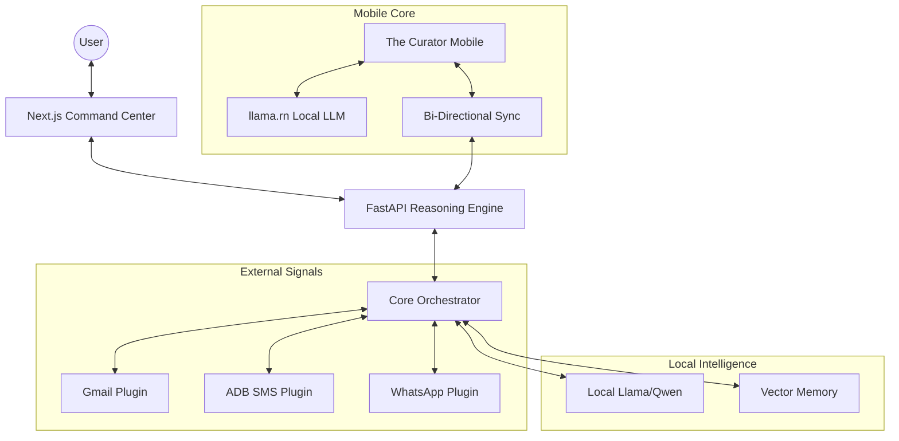

# ⚪ THE CURATOR: Personal Intelligence Enclave


> **"Privacy is not a feature; it is the foundation."**
> The Curator is a local-first, high-density intelligence assistant designed with a Nothing OS aesthetic. It unifies your digital life—Gmail, SMS, WhatsApp, and system telemetry—into a single, secure reasoning engine.

---

## ⚡ Quick Start: Absolute Ignition

To ignite the enclave and start all services (Backend, Frontend, Simulation), run:

```bash
chmod +x run_all.sh
./run_all.sh
```

- **Command Center**: [http://localhost:3000](http://localhost:3000)
- **Intelligence API**: [http://localhost:8000](http://localhost:8000)

---

## 🏗️ System Architecture



---

## 🛠️ Components

| Component | Tech Stack | Responsibility |
| :--- | :--- | :--- |
| **Backend** | Python, FastAPI, Llama-cpp | Reasoning engine, plugin management, vector memory. |
| **Frontend** | Next.js, Tailwind, Lucide | High-density dashboard, real-time telemetry, signal grid. |
| **Mobile** | React Native, llama.rn | Local-first mobile intelligence, SMS/Call bridging. |
| **Simulation** | Python | Generates synthetic life history for privacy-safe testing. |

---

## 🧩 Core Pillars

- **Zero-Cloud Philosophy**: Your data never leaves your hardware. All reasoning happens locally.
- **Signal Aggregation**: Live streams from your personal nodes (Mail, SMS) are contextualized in real-time.
- **Nothing Aesthetic**: A minimalist, dot-matrix driven UI that prioritizes information density without clutter.

---

## 📂 Documentation

- [**Development Guide**](DEVELOPMENT.md): Technical setup and environment config.
- [**Architecture Deep Dive**](ARCHITECTURE.md): How the "Brain" works.
- [**Backend Specs**](backend/README.md): API documentation and plugin dev.
- [**Mobile Setup**](mobile/README.md): React Native and `llama.rn` instructions.

---

## ⚖️ License

Copyright © 2024 Sanjay-Program. This project is private and intended for personal intelligence augmentation.
